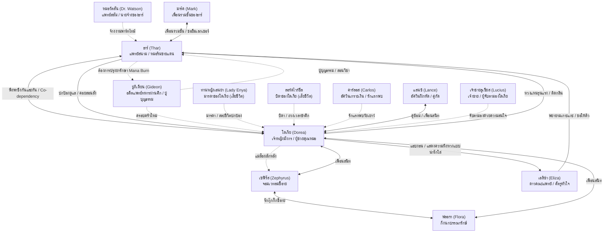

# สารบัญข้อมูลตัวละคร (Master Character Document Index)

เอกสารฉบับนี้ทำหน้าที่เป็น **ศูนย์กลางข้อมูลตัวละคร (Character Hub)** สำหรับนิยายเรื่อง **"Dorea's Journey"** โดยรวบรวมลิงก์ไปยังไฟล์ประวัติตัวละครแยกเฉพาะ พร้อมสรุปบทบาทและความสัมพันธ์เบื้องต้นเพื่อความสะดวกในการอ้างอิง

* **การออกแบบตัวละคร**: สามารถดูภาพสเก็ตช์/แนวคิดการออกแบบรูปลักษณ์ของโดเรียและธาร์ได้ที่ [การออกแบบตัวละคร (Character Designs)](file:///d:/Dorea%20Pricese%20Journey/Characters/Design_Focus.md)

---

## 1. แผนผังความสัมพันธ์ (Character Relationship Map)

---

## 2. ตัวละครเอก (Protagonists)

| ตัวละคร | ลิงก์ไฟล์ประวัติ | สรุปบทบาทและลักษณะเด่น |
| :--- | :--- | :--- |
| **ธาร์ (Thar)** | **[Thar.md](file:///D:/Dorea%20Pricese%20Journey/Characters/Thar.md)** | มนุษย์หนุ่มมาดสะอาดสะอ้าน ใส่แว่นกรอบเงิน ผมยุ่งนิดๆ อดีตเด็กกำพร้าสงคราม ปัจจุบันเป็นหมอผู้มีความสามารถสูง สุภาพ อ่อนโยน แต่พร้อมสละศีลธรรมล้างบางศัตรูด้วยวิชาต้องห้าม **Mana Core Collapse** เพื่อปกป้องโดเรีย |
| **โดเรีย (Dorea)** | **[Dorea.md](file:///D:/Dorea%20Pricese%20Journey/Characters/Dorea.md)** | เจ้าหญิงมังกรพลัดถิ่น (Dragonoid) ผิวสีแทน ผมสีเงินสว่าง ตาสีไพลิน เป็นเด็กดี ว่านอนสอนง่าย น่ารักเรียบร้อยนอบน้อมมาก ๆ ฟื้นตัวจากบาดแผลใจด้วยอ้อมกอดอุ่นของธาร์ ติดและเชื่อฟังธาร์มาก ยอมทำทุกอย่างเพื่อปกป้องเขา |

---

## 3. ผู้ปกครองและผู้ให้การสนับสนุน (Mentors & Guardians)

* **ปู่กิเดียน (Gideon)**: **[Gideon.md](file:///D:/Dorea%20Pricese%20Journey/Characters/Gideon.md)**  
  อดีตแพทย์ทหารผ่านศึกและศัลยแพทย์ทหารสงครามที่เกษียณตัวเองมาใช้ชีวิตอยู่ที่บ้านริมชายแดนท้ายหมู่บ้านกรีนวัลเลย์ ปู่บุญธรรมผู้รับเลี้ยงดูธาร์และโดเรีย กำลังเผชิญหน้ากับความตายจากโรค **Mana Burn** ที่เหลือเวลาชีวิตอีก 2 ปี
* **ท่านหญิงเอนย่า (Lady Enya)**: **[Lady_Enya.md](file:///D:/Dorea%20Pricese%20Journey/Characters/Lady_Enya.md)**  
  มารดาผู้สูงศักดิ์ของโดเรีย สละแขนซ้ายและชีวิตถ่วงเวลาเพื่อให้โดเรียหนีพ้นความตายในวันอาณาจักรล่มสลาย แขนสีเงินของนางถูกห่อด้วยเศษชุดนอนสีขาวและประคองรักษาไว้อย่างดีเป็นชิ้นส่วนยึดเหนี่ยวสุดท้ายของโดเรีย ก่อนถูกทำพิธีส่งวิญญาณ
* **ลอร์ดไวร์ชีล (Lord Wyvernshield)**: **[Lord_Wyvernshield.md](file:///D:/Dorea%20Pricese%20Journey/Characters/Lord_Wyvernshield.md)**  
  บิดาของโดเรีย (ในบทเก่า) ขุนนางผู้ปกครองนครดราโกเนีย ยืนหยัดนำทัพต้านข้าศึกที่ประตูเมืองจนตัวตายเพื่อให้ครอบครัวหลบหนี

## 4. กลุ่มเพื่อนสนิทในวัยเด็ก 3 คน (Three Childhood Friends - แก๊งสี่สหาย)

โดเรียมีเพื่อนสนิทในวัยเด็ก 3 คนที่เติบโตร่วมกันในสถาบันราชสำนักดราโกเนีย (เรียกรวมกลุ่มรวมโดเรียว่าเป็น "แก๊งสี่สหาย"):
* **แลนซ์ (Lance)**: **[Lance.md](file:///D:/Dorea%20Pricese%20Journey/Characters/Lance.md)**  
  เด็กหนุ่มตระกูลอัศวินฝึกหัด ปากเสีย กวนประสาท ชอบเบรกโดเรีย แต่ห่วงใยเธอที่สุด โดนหางโดเรียสะบัดตบพื้นขู่เป็นบางครั้ง
* **เซฟิรัส (Zephyrus)**: **[Zephyrus.md](file:///D:/Dorea%20Pricese%20Journey/Characters/Zephyrus.md)**  
  เด็กหนุ่มจอมเวทลมมาดคุณชาย สุภาพเรียบร้อย แต่ขี้อายและประหม่าอย่างหนักเมื่อสัมผัสหรืออยู่ใกล้ชิดฟลอร่า
* **ฟลอร่า (Flora)**: **[Flora.md](file:///D:/Dorea%20Pricese%20Journey/Characters/Flora.md)**  
  เด็กสาวเผ่ากึ่งนกเวทมนตร์ผู้ดูแลหอสมุดหลวง ร่างกายอ้อนแอ้น ขี้ตกใจและขี้อาย โดยมีโดเรียรับหน้าที่เป็นแม่สื่อคอยวางแผนผลักดันความสัมพันธ์กับเซฟิรัส

---

## 5. ผู้พิทักษ์และรักแรกพบ (Guardian & First Love)

* **คาร์ลอส (Carlos)**: **[Carlos.md](file:///D:/Dorea%20Pricese%20Journey/Characters/Carlos.md)**  
  หัวหน้าองครักษ์เวหาเกราะเงินผู้ช่วยโดเรียวัย 10 ขวบจากการตกหน้าผา เป็นรักแรกพบวัยเด็กที่ทำให้โดเรียเขินหางส่ายตบฝุ่นตลบ

---

## 6. บุคคลในเมืองหลวงและมหาวิทยาลัย (Aethelgard University & Slums)

* **เจ้าชายลูเซียส (Prince Lucius)**: **[Lucius.md](file:///D:/Dorea%20Pricese%20Journey/Characters/Lucius.md)**  
  เจ้าชายแห่งเอเธลการ์ด สอบเข้าได้อันดับที่ 1 ของมหาวิทยาลัยหลวง แอบจับตามองโดเรียด้วยความสนใจหลังจากเธอยกมือตอบวิชาประวัติศาสตร์อย่างเฉียบคม
* **เอลิซ่า (Eliza)**: **[Eliza.md](file:///D:/Dorea%20Pricese%20Journey/Characters/Eliza.md)**  
  ดาวคณะแพทย์ทายาทโรงพยาบาลใหญ่ พยายามใช้มารยาเข้าหาธาร์เพื่อหวังให้ช่วยติวตำราแพทย์ ตกเป็นเป้าสายตาแห่งความแสนงอนและหึงหวงเล็กๆ ของโดเรีย
* **มาร์ค (Mark)**: **[Mark.md](file:///D:/Dorea%20Pricese%20Journey/Characters/Mark.md)**  
  เพื่อนร่วมชั้นเรียนของธาร์ ช่างสงสัย มักขอยืมใบจดเลกเชอร์ และเกือบไขความลับของห้อง 404 เรื่องกลิ่นดอกลิลลี่มังกรและเขาของโดเรีย
* **หมอวัตสัน (Dr. Watson)**: **[Dr_Watson.md](file:///D:/Dorea%20Pricese%20Journey/Characters/Dr_Watson.md)**  
  แพทย์สลัมขี้เหล้าปากร้ายใจดี จ้างธาร์เป็นแพทย์พาร์ทไทม์เพื่อรักษาคนยากไร้ในสลัมเอเธลการ์ด ช่วยเหลือค่าเช่าอพาร์ทเมนท์ 404

---

## 7. ตัวละครประกอบย่อยอื่นๆ (Minor Supporting Characters)

* **ตัวละครประกอบย่อย**: **[Minor_Characters.md](file:///D:/Dorea%20Pricese%20Journey/Characters/Minor_Characters.md)**  
  ข้อมูลรวมของตัวละครย่อยอื่นๆ เช่น หัวหน้าพ่อครัวหลวง, พี่เลี้ยงหญิงสูงวัย, อัศวินคู่ซ้อมดาบ, นายกองทหารมนุษย์, พลซุ่มยิงมนุษย์, เธรด (เจ้าหน้าที่แลกเปลี่ยนวัตถุดิบ), ลุงเจ้าของเกวียน/ร้านขายข้าวสาร, คนขับรถม้าชนหิน, แม่ลูกที่เกือบโดนหินทับ, กลุ่มเพื่อนสาวของเอลิซ่า, และศาสตราจารย์เฒ่าวิชาประวัติศาสตร์มังกร
