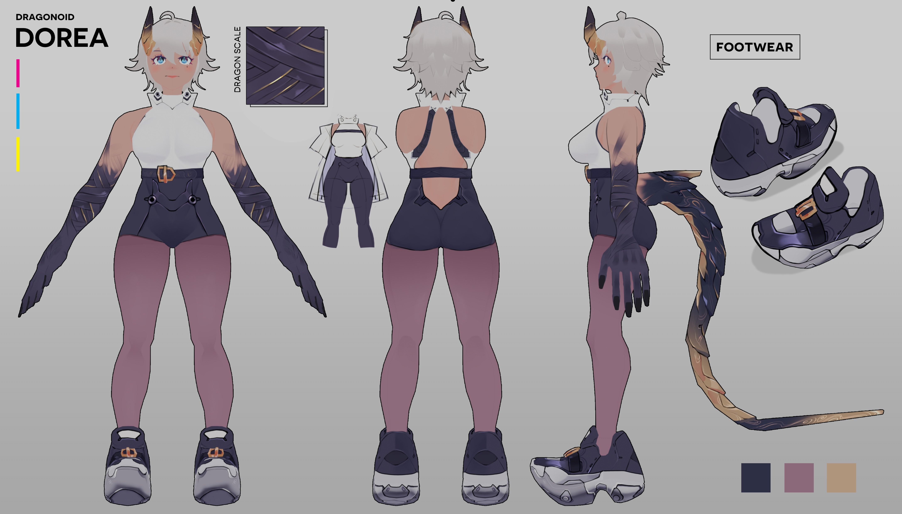

# ข้อมูลตัวละคร: โดราริน่า (Dorarina)

* **ชื่อเต็ม**: เลดี้โดราริน่า ไวท์ชีลด์ (Lady Dorarina Whiteshilde) หรือ เจ้าหญิงโดราริน่า (Princess Dorarina) / ชื่อเล่น: โดเรีย (Dorea)
* **ชื่อแฝงในทะเบียนราษฎร์ (Aeran Alias)**: โดราริน่า อีแวนครอส (Dorarina Evancross)
* **ฉายา**: เจ้าหญิงมังกรพลัดถิ่น, ราชินีสนามรบ (Battlefield Queen)
* **เผ่าพันธุ์**: ดราโกนอยด์ (Dragonoid - มนุษย์มังกรสายเลือดขุนนางชั้นสูง)
* **ส่วนสูง**: 167 ซม. (สูงเพรียว สง่างาม หุ่นนางแบบ)
* **อายุ**: 13 ปี (ช่วงต้นป่าชายแดน) -> 18 ปี (ช่วงมหาวิทยาลัย)
* **ภาพการออกแบบตัวละคร**:  (สามารถดูรายละเอียดเพิ่มเติมได้ที่ [แนวคิดการออกแบบตัวละคร](../Characters/Design_Focus.md))

---

## 1. รูปลักษณ์ภายนอก (Appearance)

* **ลักษณะเด่น**:
  * **เขา (Horns)**: เขาคู่เล็กสีดำทองงดงามโค้งรับหน้าผาก งอกโดดเด่นสะดุดตาคล้ายมงกุฎ
  * **หาง (Tail)**: หางเรียวยาว เกล็ดสีดำทองเหลือบเงิน ปลายแหลม แข็งแกร่งมากจนใช้ฟาดเป็นอาวุธหรือใช้เกี่ยวเกาะสิ่งของได้ เป็นอวัยวะแสดงความรู้สึกที่แท้จริงแบบปิดไม่มิด (ดูรายละเอียดภาษากายของหางใน `Species_Dragonoid.md`)
  * **ผิวพรรณ (Skin)**: ผิวสีแทน (Tan Skin) เนียนละเอียด มีความหนาแน่นและทนทานสูงมาก ได้รับกรรมพันธุ์บิดา (ท่านหญิงเอนย่าผู้เป็นมารดามีเกล็ดและผิวสีเงินสว่าง)
  * **ผม (Hair)**: ผมสีเงินสลวยสว่างโทนขาว ยาวประกายรุ้งล้อมรอบใบหน้า
  * **ดวงตา (Sapphire Eyes)**: สีน้ำเงินไพลิน (Sapphire Blue) ทอประกายลึกลับ จะเปลี่ยนเป็นรูม่านตาทรงรีแบบสัตว์ร้ายยามโกรธหรือใช้สัญชาตญาณมังกร
* **สไตล์การแต่งตัว**:
  * **เวลาอยู่ภายนอก**: สวมชุดคลุมฮู้ดสีน้ำตาลตัวใหญ่เพื่อซ่อนเขาและหาง ปิดบังตนเองไม่ให้มนุษย์เห็น
  * **เวลาอยู่ในบ้าน / ต่อสู้**: ชอบเสื้อผ้าขยับตัวสะดวก เสื้อกล้ามรัดรูป กางเกงขาสั้น หรือชุดหนัง เนื่องจากอุณหภูมิร่างกายสูงและแผ่ความร้อนตลอดเวลา

---

## 2. นิสัยและบุคลิก (Personality)

* **บุคลิกหลัก**: เด็กดี ว่านอนสอนง่าย น่ารักและเรียบร้อยนอบน้อมมาก ๆ เรียนเก่ง เรียนรู้ได้เร็วและหัวดี ทว่าในบางครั้งก็มีความเอาแต่ใจหรือมีความ "ดื้อ" ตามประสาเด็กโผล่มาให้เห็น (เช่น การดื้อไม่ยอมใส่รองเท้าบูทหนาวเย็น การลากผ้าห่มทำรังอุ่น หรือความดื้อดึงที่จะปีนเขาหาดอกไม้ให้แม่) แต่เป็นการดื้อแบบกุลสตรีที่น่ารักน่าเอ็นดูจนผู้ใหญ่โกรธไม่ลง และเมื่อทำผิดพลาดก็จะยอมรับผิดและสำนึกเสียใจในทันที
* **อาการบอบช้ำ (PTSD & Trauma - Feral Despair)**: หลังผ่านโศกนาฏกรรมล้างเผ่าพันธุ์ เธอสูญเสียความแกร่งกร้าว เหลือเพียงจิตใจที่แตกสลาย สิ้นหวัง ตื่นตระหนกจากสิ่งกระตุ้น (เสียงระเบิด, เปลวไฟ, ควันปืน, และความหนาวเย็นที่เป็นสัญลักษณ์ความสูญเสีย) และหวงแหนสิ่งยึดเหนี่ยวคือท่อนแขนซ้ายสีเงินของมารดาปานชีวิต พุ่งโจมตีธาร์ด้วยความระแวงเข้าใจผิดในวันแรก ก่อนจะยอมสยบต่อไออุ่นและอ้อมกอดมั่นคง ร้องไห้โฮและหลับไป
* **กับธาร์ (Co-dependency & Devotion)**:
  * มองธาร์เป็น "พื้นที่ปลอดภัย" เพียงหนึ่งเดียวและเป็นพี่ชายที่เธอรัก เคารพ และว่าง่าย อ่อนโยนด้วยมาก ๆ
  * มีนิสัยติดธาร์ ชอบซุกไหล่และใกล้ชิดเพื่อรับไออุ่นและกลิ่นของธาร์ คอยออดอ้อนและส่งสายตาละห้อยหวงแหนเวลาอยู่กับเขา มีความหึงหวงรุนแรงหากมีหญิงอื่นมาใกล้ชิดธาร์
  * ว่านอนสอนง่าย คอยช่วยเหลือและดูแลธาร์อยู่เสมอ

---

## 3. ความสามารถและสไตล์การต่อสู้ (Abilities & Combat Style)

* **Somatic Mana/Aether Reinforcement (การเสริมแกร่งเรือนร่าง)**: พละกำลังและความแข็งแกร่งมหาศาลของเธอเกิดจากการถ่ายมานาและเอเธอร์เวียนผ่านเส้นใยกล้ามเนื้อจากแก่น Mana Core ในตัวอย่างสมบูรณ์ ทำให้เธอยกบล็อกหินขนาดใหญ่และเคลื่อนไหวได้ด้วยความเร็วสูง ในชีวิตประจำวันโดราริน่าสามารถควบคุมแรงและจับสิ่งของได้อย่างปกติราบรื่น
* **สไตล์การต่อสู้ (Hand-to-Hand Combat)**: แตกต่างจากนักรบดราโกนอยด์ทั่วไปที่มักใช้ "หอก" เป็นอาวุธ โดราริน่าเข้าใจศาสตร์การใช้อาวุธดี แต่เธอเลือกที่จะ **ไม่ใช้อาวุธตายตัว** สไตล์หลักของเธอคือการต่อสู้ระยะประชิด ใช้ความเร็ว หมัด กรงเล็บ หรือมือเปล่าในการตวัด ต่อย และบดขยี้ศัตรูโดยตรง
* **Original Magic & Body Alteration (เวทมนตร์และการแปรสภาพ)**: โดราริน่าไม่เน้นการยิงเวทมนตร์เป็นลำแสง แต่เน้นใช้เวทมนตร์ออริจินัลเพื่อ **แปรสภาพภูมิประเทศ** หรือ **แปรสภาพร่างกายตนเอง** (เช่น การควบคุมเส้นผมสีเงินให้ขยับพริ้วไหวและแข็งแกร่งดุจเหล็กกล้าเพื่อเสริมการโจมตีหรือป้องกันได้อย่างอิสระ)
* **Dragon Transformation**:
  * **Partial (บางส่วน)**: งอกกรงเล็บแหลมคมและเกล็ดมังกรตามแขนขาเพื่อรับแรงปะทะและเพิ่มพลังทำลาย
  * **Calamity Form (ร่างคาลามิตี้)**: ร่างต่อสู้ขั้นสูงที่จะเพิ่มสมรรถภาพและขีดจำกัดทางร่างกายขึ้นไปอีกขั้น ร่างกายจะขยายมวลกล้ามเนื้อและส่วนสูง หางและเขาใหญ่ขึ้น ถูกปกคลุมด้วยเกล็ดสีดำทมิฬและมีลวดลายเส้นแสงสีทองแบบ **Abstract Geometric Lines** เคลื่อนไหวไปมาทั่วร่างเพื่อรักษาโมเลกุลไม่ให้สลายตัวกลายเป็นมังกรไร้สติ
* **Manners & Nobility**: มีกิริยามารยาทและการวางตัวระดับสูงแบบขุนนาง เรียนเก่งและมีความคิดเฉลียวฉลาด เรียนรู้ไวมาก

---

## 4. ประวัติและการเติบโต (Chronological Development)

* **วัย 0-1 ปี**: เกิดปี D.S. 788 ในคืนจันทร์ดับฤดูหนาว ร้องไห้โยเยธรรมดายามหิวนมหรือตื่นนอนตามประสาเด็ก แต่สงบลงทันทีในอ้อมกอดแม่เอนย่า บีบนิ้วมารดาแน่นด้วยแรงบีบมหาศาล เขาคู่แรกเริ่มงอกดันหน้าผากตอนอายุ 9 เดือนจนเกิดคัน ดื้อไล่เอาเขาโขกไหล่แม่ โต๊ะ และสิ่งของต่าง ๆ
* **วัย 3 ปี**: เกิดปี D.S. 791 เรียนรู้คำศัพท์และประวัติศาสตร์ได้รวดเร็วมาก มีความดื้อและเอาแต่ใจเล็ก ๆ เช่น ไม่ยอมใส่รองเท้าบูทหนังแข็งลากผ้าห่มขนสัตว์ทำรังอุ่นหน้าเตาผิงและอ้อนแม่นมเซลีนจนโกรธไม่ลง วิ่งวนไล่จับหางตนเองจนก้นจ้ำเบ้า แอบอมผลึกมานาดิบสีแดงชาดและยอมคายออกและสำนึกเสียใจทันทีเมื่อมารดาดุ
* **วัย 5 ปี**: เกิดปี D.S. 793 แสดงออกชัดเจนว่าเกลียดอากาศเย็นและลมหนาวเด่นชัด ต่อรองขอแก้ซับในกระโปรงยาวในงานเลี้ยง และแอบหลบหนีไปกินเนื้อย่างราดซอสเผ็ดร้อนหลังครัวเพื่อรับความอุ่น ไปโรงเรียนหลวงวันแรก เรียนเก่งหัวไววิเคราะห์อักขระเวทเด่นชัด ยกโต๊ะไม้หนาเพื่อเก็บของเล่นให้ฟลอร่าจนเพื่อน ๆ ตาค้าง เซฟิรัสเผลอปล่อยเวทลมพัดกระโปรงทำให้โดราริน่าอายจนหางรัดโคนขาแน่น ช่วยคนสวนถอนวัชพืชดึงต้นไม้หายากหลุดติดรากดินก้อนยักษ์
* **วัย 7 ปี**: เกิดปี D.S. 795 เรียนรู้ทฤษฎีความแตกต่างระหว่างเอเธอร์และมานาได้ไวกว่าเพื่อน นั่งสมาธิและจุดเปลวไฟรุ้งดวงแรกเหนือปลายนิ้วได้สำเร็จในการพยายามครั้งแรก ซ้อมประลองวิชาต่อสู้เผลอฟันดาบไม้หักคามือ ยอมทนลมหนาวในพายุหิมะหลงฤดูเพื่อจุดลูกไฟมานาอุ่น ๆ ช่วยต่อชีวิตลูกนกเขาหิมะตกรัง
* **วัย 9 ปี**: เกิดปี D.S. 797 สวมบทแม่สื่อผลักหลังเซฟิรัสและฟลอร่าจนชั้นหนังสือล้ม รู้สึกผิดอย่างรุนแรงร้องไห้ก้มศีรษะขอโทษอย่างจริงใจจนเพื่อน ๆ ให้อภัย และแลนซ์ยื่นผ้าเช็ดหน้าให้ ร่วมกิจกรรมล่าไข่อสูรคู่แลนซ์กัดและเถียงกันดื้อรั้นแต่ใช้พละกำลังกางกรงเล็บรับกรงเล็บหุ่นอสูรป้องแลนซ์ไว้ เล่นซ่อนหาในวิหารเกาะเสาหินแน่นจนร้าวรอยนิ้วมือ รีบยืนหันหลังพิงบังรอยร้าวกลัวคาร์ลอสเห็น
* **วัย 10 ปี**: เกิดปี D.S. 798 ทนความหนาวที่เกลียดแอบปีนผาน้ำแข็งเก็บดอกบุปผาหิมะให้มารดาแล้วร่วงหล่น คาร์ลอสรับร่างกลางอากาศทำให้ตกหลุมรักแรกพบเขินจนหางตีดินตลบ ฝึกมารยาทโต๊ะอาหารกุลสตรีเกร็งและประหม่าจนปลายหางส่ายสะบัดตีกระทบพนักเก้าอี้ไม้ดังปั้กๆ ฟ้องอารมณ์ประหม่า ติดตามหน่วยอัศวินของคาร์ลอสไปชายขอบเกาะช่วยตรึงปีกกริฟฟินป่าบาดเจ็บได้อย่างมีสติสงบ
* **วัย 13 ปี (คืนสุดท้าย)**: เกิดปี D.S. 801 ช่วยเอนย่าแยกเอกสารปกครองแบ่งเบาภาระได้มาก นอนหนุนตัก ได้รับช่อดอกลิลลี่มังกรแดงกลิ่นวานิลลา สัญญาจะเป็นอัศวินที่เก่งเพื่อปกป้องทุกคน ซ้อมดาบประลองกับแลนซ์คว้าดาบไม่ยอมแพ้จนร้าวเสมอ ช่วยนวดแป้งทำขนมปังสมุนไพรแจกทหารจนแป้งเลอะใบหน้ากตัญญูป้อนชิ้นแรกให้เอนย่า
* **วัย 13 ปี (จุดเปลี่ยน - วันที่ท้องฟ้าล่ม)**: อาณาจักรลอยฟ้าดราโกเนียถูกเอเธลการ์ดบุก แม่นมเซลีนโดนฉมวกยักษ์เสียบตรึงเสียชีวิตต่อหน้าต่อตา ต้องตัดใจทิ้งร่างพี่ลิซ่าที่จมกองเลือดหนีภัย ท่านหญิงเอนย่าเอาตัวเข้าบังกระสุนฉมวกยักษ์แทนโดราริน่าจนแขนซ้ายสีเงินขาดสะบั้น เอนย่าปักดาบเปิดวงเวทส่งโดราริน่าข้ามมิติหนีไป โดราริน่าร้องไห้กอดแขนซ้ายมารดาที่ขาดแนบอกข้ามมิติมา
* **วัย 13-18 ปี (ช่วงกรีนวัลเลย์)**: ใช้ชีวิตในบ้านริมชายแดนท้ายหมู่บ้านกรีนวัลเลย์กับธาร์และปู่กิเดียน ดูแลเศษกระดูกมารดา ปลดล็อกความเศร้าทำพิธีฌาปนกิจส่งวิญญาณแม่ สวมกำไลข้อมือทองคำสลักรูนมังกรของมารดา ช่วยเหลืองานในหมู่บ้านและป่าดงดิบ
* **วัย 18 ปี (ช่วงมหาวิทยาลัย)**: เข้าเรียนที่มหาวิทยาลัยหลวงเอเธลการ์ด สอบผ่านปฏิบัติอันดับ 10 และรับงานพิเศษโค้ดเนม "ซิลเวอร์ (Silver)" ในกิลด์นักล่า
