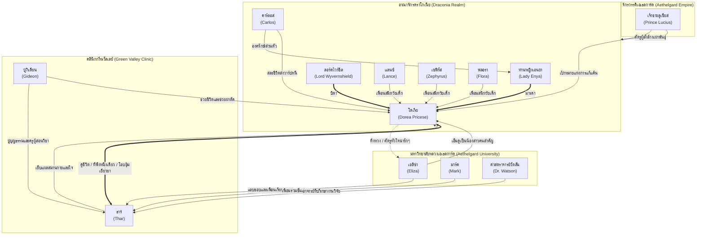

# แผนผังความสัมพันธ์ตัวละคร (Character Relationship Map)

---

## 1. แผนผังความสัมพันธ์ระดับเครือข่าย (Relationship Flowchart)

---

## 2. คำอธิบายรายละเอียดสายสัมพันธ์ (Relationship Details)

### สายสัมพันธ์หลัก (Core Relationship)
* **ธาร์ & โดเรีย (Thar & Dorea)**:
  * **หมอผู้เยียวยา & เจ้าหญิงมังกรพลัดถิ่น**: ธาร์เป็นคนแรกที่โอบกอดโดเรียในคืนพายุโหม ช่วยเย็บแผลที่หลัง คอยป้อนยาและให้ไออุ่นซับน้ำตา
  * **ความไว้เนื้อเชื่อใจขีดสุด**: โดเรียติดธาร์มาก เชื่อฟังและอ้อนคลอเคลียเขาทุกเวลา ร่างกายของโดเรียตอบสนองสัมผัสของธาร์เพียงคนเดียวอย่างปลอดภัย
  * **การปกป้องสองทาง**: ธาร์พร้อมใช้ *Mana Core Dissection* ล้างบางศัตรูหากใครกล้าทำร้ายโดเรีย ในขณะที่โดเรียก็พร้อมกางเล็บคาลามิตี้ปกป้องชีวิตธาร์เช่นกัน

### สายสัมพันธ์ครอบครัว & ผู้มีพระคุณ (Family & Guardians)
* **ปู่กิเดียน & ธาร์ (Gideon & Thar)**:
  * ปู่กิเดียนเก็บธาร์มาเลี้ยงดูตั้งแต่ยังเป็นเด็กกำพร้าสงคราม ถ่ายทอดวิชาแพทย์สนามและการปรุงยาสมุนไพรให้ธาร์จนหมดสิ้น
* **ท่านหญิงเอนย่า & ลอร์ดไวร์ชีล & โดเรีย (Lady Enya & Wyvernshield & Dorea)**:
  * บิดามารดาผู้ปกครองดราโกเนีย ท่านหญิงเอนย่าสละแขนซ้ายและสละชีวิตเปิดม่านเกราะเอเธอร์ส่งโดเรียหนีผ่านรอยแยกมิติ
* **คาร์ลอส & โดเรีย (Carlos & Dorea)**:
  * อัศวินมังกรผู้ซื่อสัตย์ของเอนย่า เป็นผู้พาย้ายร่างโดเรียหลบหนีระหว่างสงครามและส่งต่อคำสั่งเสียของมารดา

### สายสัมพันธ์ในสถาบัน & ความรักยุ่งเหยิงน่ารัก (Academy & Rivals)
* **ธาร์ & เอลิซ่า (Thar & Eliza)**:
  * เอลิซ่าเป็นดาวคณะแพทยศาสตร์ บุตรีของเจ้าของโรงพยาบาลเวทมนตร์อันดับหนึ่ง เธอแอบชอบธาร์ในความสุขุมฉลาดหลักแหลม คอยช่วยเหลือเรื่องตำราวิชาการ
* **เอลิซ่า & โดเรีย (Eliza & Dorea)**:
  * เอลิซ่ามองโดเรียด้วยความเอ็นดูบริสุทธิ์แบบ "น้องสาวคนสำคัญ" ของธาร์ ไร้อคติเรื่องเผ่าพันธุ์
  * โดเรียมองเอลิซ่าเป็น **"ศัตรูหัวใจอันดับหนึ่ง"** ด้วยสัญชาตญาณหึงหวงน่ารักๆ ยามเอลิซ่าเข้าใกล้ธาร์ ก่อนจะค่อยๆ ยอมรับเธอในภายหลัง

---

## 3. สรุปขั้วอำนาจและความขัดแย้ง (Conflict Structure)

* **ดราโกนอยด์ (Draconia)** ⚔️ **จักรวรรดิเอเธลการ์ด (Aethelgard Empire)**:
  * สงครามกวาดล้างเผ่าพันธุ์มังกรโดยคำสั่งของเจ้าชายลูเซียส ด้วยความริษยาในพลังเอเธอร์และหวังครอบครองผลึกมานาโบราณ
