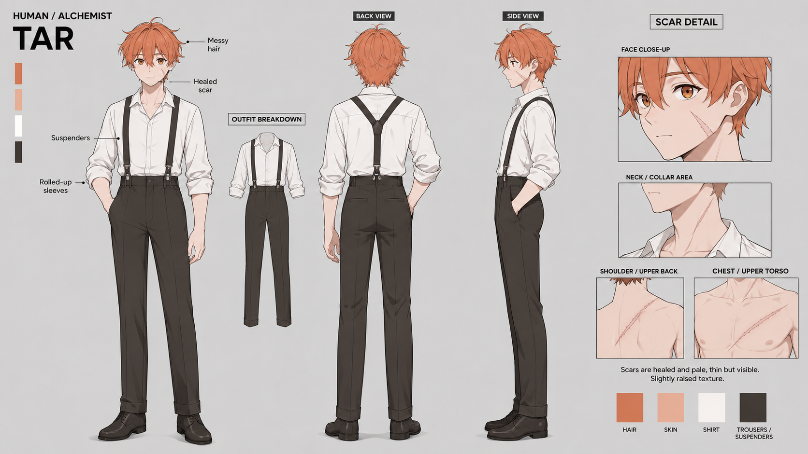

# ข้อมูลตัวละคร: ธาร์ (Thar)

* **ชื่อเต็มปัจจุบัน**: ธาริคนา อีแวนครอส (Tharicnar Evancross)
* **ชื่อเต็มดั้งเดิม**: ธาริคนา อัลมิสต์ (Tharicnar Almist)
* **ชื่อเล่น**: ธาร์ (Thar)
* **ฉายา**: แพทย์แห่งหายนะ (The Physician of Calamity) / คุณหมอแว่น (โดยโดราริน่า)
* **เผ่าพันธุ์**: ชาวเอร่า / มนุษย์ (Aeran)
* **ส่วนสูง**: 178 ซม. (หุ่นสมส่วน สะอาดสะอ้าน มีกล้ามเนื้อกระชับและเส้นเลือดคมชัดจากการทำงานช่างและยกของหนัก)
* **อายุ**: 15 ปี (ช่วงต้นป่าชายแดน) -> 20 ปี (ช่วงมหาวิทยาลัย) -> 22+ ปี (ช่วงสงคราม)
* **ภาพการออกแบบตัวละคร**:  (สามารถดูรายละเอียดเพิ่มเติมได้ที่ [แนวคิดการออกแบบตัวละคร](../Characters/Design_Focus.md))

---

## 1. รูปลักษณ์ภายนอก (Appearance)

* **สไตล์การแต่งตัว**:
  * ลุคดูสะอาดสะอ้านและมีระเบียบวินัยสูง ไม่ใช่หมอสติเฟื่องที่ใส่กาวน์เปรอะเปื้อน
  * มักสวมเสื้อเชิ้ตสีขาวพอดีตัว พับแขนเสื้อขึ้นมาถึงข้อศอกเสมอ (เผยให้เห็นเส้นเลือดท่อนแขนเวลาทำงานรักษาหรือผ่าตัด)
  * กางเกงสแล็คสีดำเข้ารูปเรียบร้อย เข็มขัดหนัง ชายเสื้อยัดเข้าใน โชว์ช่วงขาที่ยาว
  * สวมแว่นตากรอบกลมบางสีเงิน (กรอบเก่าเคยหัก และโดราริน่าซื้ออันใหม่เลนส์ตัดแสงมานา 100% กรอบไทเทเนียมผสมมิธริลระดับพรีเมียมให้เป็นของขวัญ)
* **หน้าตา**: ผมสีน้ำตาลอ่อนมักยุ่งจางๆ (Messy Hair) เล็กน้อย ดูดีเป็นธรรมชาติ ดวงตาสีน้ำตาลฉายแววตื่นรู้ ฉลาดหลักแหลม แต่ปนความง่วงงุนจากการอดนอนศึกษาตำราแพทย์
* **รอยแผลเป็น**:
  * มีรอยแผลเป็นจางๆ ที่แก้มซ้าย (ฝีมือโดราริน่าข่วนตอนพบกันครั้งแรกท่ามกลางฝนตก)
  * มีรอยแผลเป็นที่ลาดไหล่ซ้าย (เกิดจากการที่โดราริน่าจิกยึดไหล่และแขนซ้ายของเขาแน่นยามระแวงและจับไข้ละเมอ)

---

## 2. นิสัยและบุคลิก (Personality)

* **ภายนอก**: สุภาพเรียบร้อย อ่อนโยนและพูดเพราะลงท้ายด้วย "ครับ" เสมอ มีบุคลิกที่อบอุ่นเป็นมิตรและพึ่งพาได้ตามแบบฉบับคุณหมอในอุดมคติ ใจเย็นและไม่เคยแสดงอารมณ์โกรธฉุนเฉียวง่ายๆ
* **ความคิด**: ฉลาดเป็นกรด ช่างสังเกต วิเคราะห์อาการป่วยและวิธีรักษาได้อย่างรวดเร็วแม่นยำ
* **กับโดราริน่า (Co-dependency & Care)**:
  * เป็นพี่ชายและคู่ชีวิตที่ตามใจและเข้าใจความเจ็บปวดของโดราริน่ามากที่สุด ยอมเจ็บตัวเพื่อปกป้องและรักษาจิตใจที่แตกสลายของเธอ แผ่ไออุ่นดูแลเธอ
  * รักษาขอบเขตอันเหมาะสม ใช้ถ้อยคำสุภาพปลอบใจ "ไม่เป็นไรแล้วนะครับ... ไม่เป็นไรแล้ว... ปลอดภัยแล้วนะครับ..."
  * ยอมรับพฤติกรรมอ้อน คลอเคลีย และการแสดงความเป็นเจ้าของของโดราริน่าอย่างเต็มใจ แม้บางครั้งจะเขินอายจนต้องแก้เก้อด้วยการจับแว่นหรือหันไปจัดอุปกรณ์การแพทย์ข่มใจ
* **พรสวรรค์ด้านมานา (Mana Prodigy)**: หัวกะทิด้านการประยุกต์ใช้งานมานา มีพรสวรรค์ที่สามารถทำความเข้าใจและควบคุมพลังงานมานาได้อย่างละเอียดอ่อนและแม่นยำเป็นพิเศษ

---

## 3. ความสามารถและสกิล (Abilities & Skills)

* **Passive Skill: Absolute Mana Precision (การควบคุมมานาความละเอียดสูง)**: แม้ธาร์จะสัมผัสมานาได้แต่ไม่มีแกนพลัง (Mana Core) ที่ทรงพลังเทียบเท่าสิ่งมีชีวิตเวทมนตร์อื่น ๆ ทว่าเขากลับมีพรสวรรค์ระดับอัจฉริยะด้านการควบคุมกระแสมานาได้อย่างแม่นยำและละเอียดอ่อนถึงขีดสุด เขาประยุกต์ใช้พลังนี้ได้หลากหลายจนสามารถเป็นพ่อมดที่เก่งกาจได้สบาย ๆ แต่ธาร์เลือกเส้นทางของการเป็นหมอและอุทิศพรสวรรค์นี้เพื่อรักษาคน
* **Anatomical Suture & Mana Infused Surgeon (หัตถการเวชและเข็มมานา)**: ฝีมือการทำแผลและผ่าตัดด้วยสมาธิขั้นสูง ธาร์ลำเลียงกระแสมานาสลักลงบนเครื่องมือแพทย์ เสริมความแข็งแกร่งให้เข็มเย็บแผลจนสามารถแทงทะลวงผ่านเกล็ดผิวของดราโกนอยด์ที่หนาเป็นพิเศษของโดราริน่าได้อย่างแม่นยำและราบรื่น ไร้การสะดุด
* **Mana Core Dissection (หัตถการชำแหละแกนมานา - Signature Move)**:
  * วิชาต้องห้ามระดับสูงสุดที่ประยุกต์จากความรู้ด้านกายวิภาคและจุดตายของกระแสมานา เป็นการส่งเข็มมานาเจาะทะลวงจุดศูนย์กลางพลังงานของเป้าหมายอย่างแม่นยำเพื่อตัดขาดการไหลเวียน ทำให้ระบบพลังงานล้มเหลวเฉียบพลันและร่างกายช็อกหมดสติโดยไร้บาดแผลภายนอก เป็นวิชาอันตรายที่ธาร์จะยอมใช้เฉพาะเมื่อต้องการปกป้องโดราริน่าเท่านั้น
* **Clinical & Surgical Mastery (อายุรศาสตร์และศัลยศาสตร์ขั้นสูง)**: ความรู้และฝีมือทางอายุรกรรมและการผ่าตัดระดับปรมาจารย์ การตรวจวินิจฉัย การเย็บแผล คลีนแผลได้อย่างรวดเร็วแม่นยำตามตำราวิชาการแพทย์ที่ได้รับการถ่ายทอดจากปู่กิเดียน

---

## 4. ประวัติและการเติบโต (Chronological Development)

* **วัย 10 ปี**: สูญเสียหมู่บ้านและพ่อแม่ (ช่างไม้และช่างเย็บผ้า) ไปในกองเพลิงสงคราม นั่งเหม่อกอดกุมท่อนแขนไร้ชีพของพ่อแม่จมเถ้าถ่านขี้เถ้าดินโคลนอย่างไร้น้ำตาแต่ดวงตาสิ้นหวัง (Shared Trauma ขนานกับโดราริน่า) ปู่กิเดียนมาพบและกอดดึงจิตใจขึ้นมา ชุบเลี้ยงในบ้านริมชายแดนท้ายหมู่บ้านกรีนวัลเลย์
* **วัย 11-12 ปี**: ใช้การศึกษาแพทย์และอักขระเวท ตลอดจนความมีเหตุผลของวิชาชีพเป็นเกราะป้องกันทางใจเพื่อเยียวยาความเศร้าโศกไม่ให้ฟุ้งซ่าน เพียรฝึกฝนหัตถการเย็บแผลบนผิวผลไม้เปลือกบาง (องุ่น ส้ม มะเขือเทศ มะนาว) และหนังสัตว์หนานับหมื่นครั้งจนปลายนิ้วด้านชาและมือนิ่งสนิทเฉียบคม รักษาชีวิตสุนัขจรจัดบาดเจ็บท้องฉีกขาดเป็นงานรักษาชีวิตแรกสำเร็จด้วยมือนิ่งมั่นคง
* **วัย 15 ปี**: พบโดราริน่านอนคว่ำหน้าบาดเจ็บในคืนฝนตก ทนเจ็บยอมโดนข่วนแก้มซ้ายและจิกไหล่ซ้ายเพื่อกอดรัดปลอบประโลมจิตใจเธออย่างนุ่มนวลและสุภาพ แบกเธอที่ตัวหนักแน่นดั่งหินผาขึ้นหลังอย่างทุลักทุเลฝ่าพายุกลับบ้าน ทำแผลเย็บแผลกว่า 30 ฝีเข็มบนเกล็ดหนาของดราโกนอยด์
* **วัย 15-20 ปี**: ดูแลประคับประคองโดราริน่า สอนวิชาความรู้และการใช้อักขระภาษาเวทให้ เรียนรู้อาการป่วยของปู่กิเดียน ตั้งเป้าหมายชิงทุนเข้ามหาวิทยาลัยเพื่อหายารักษาปู่กิเดียน
* **วัย 20 ปี (ช่วงมหาวิทยาลัย)**: สอบผ่านข้อเขียนชิงทุนอันดับ 9 ของสถาบันหลวง ทำงานพิเศษที่คลินิกยากจนของหมอวัตสันและสถาบันวิจัยการแพทย์พิเศษเกรด A
